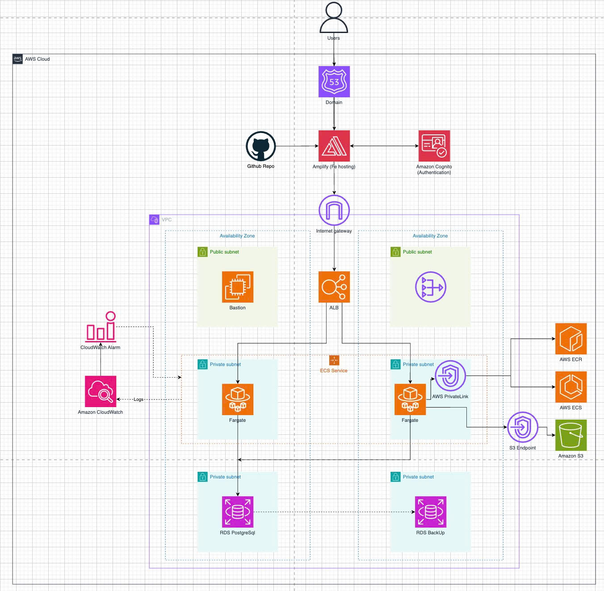

# SpendWiseApp

Expense management app with:

- `frontend/`: Next.js (Amplify hosting)
- `backend/`: NestJS + Prisma (ECS Fargate)
- `infrastructure/`: Terraform (VPC, ALB, ECS, RDS, Cognito, Amplify, ECR)

## Cloud Architecture



## Run Locally with Docker

### Option A: Full stack

```bash
docker compose -f docker-compose.yml up --build
```

- App via Nginx: `http://localhost:3000`
- Backend direct: `http://localhost:5001`

Stop:

```bash
docker compose -f docker-compose.yml down
```

Reset including volumes:

```bash
docker compose -f docker-compose.yml down -v
```

### Option B: App only (external DB)

```bash
docker compose -f docker-compose.app.yml up --build
```

## Deploy AWS Infrastructure (Terraform)

Run from project root:

```bash
terraform -chdir="infrastructure/environments/dev" init
terraform -chdir="infrastructure/environments/dev" plan -var-file="terraform.tfvars"
terraform -chdir="infrastructure/environments/dev" apply -var-file="terraform.tfvars"
```

Destroy when needed:

```bash
terraform -chdir="infrastructure/environments/dev" destroy -var-file="terraform.tfvars"
```

## Build and Push Backend Image to ECR

1) Get ECR repository URL from Terraform output:

```bash
terraform -chdir="infrastructure/environments/dev" output -raw ecr_repository_url
```

2) Login Docker to ECR:

```bash
aws ecr get-login-password --region <aws-region> \
  | docker login --username AWS --password-stdin <aws-account-id>.dkr.ecr.<aws-region>.amazonaws.com
```

3) Build and push image:

```bash
docker build -t spendwise-backend:latest ./backend
docker tag spendwise-backend:latest <ecr_repository_url>:<image_tag>
docker push <ecr_repository_url>:<image_tag>
```

4) Update Terraform variable `ecs_backend_image_tag` and apply again.

## Run First Database Migration

After RDS is up and backend image is available, run migration in ECS one-off task.

Example command:

```bash
aws ecs run-task \
  --cluster <ecs_cluster_name> \
  --launch-type FARGATE \
  --task-definition <task_definition_arn_or_family> \
  --network-configuration "awsvpcConfiguration={subnets=[<subnet-1>,<subnet-2>],securityGroups=[<ecs-sg>],assignPublicIp=DISABLED}" \
  --overrides '{"containerOverrides":[{"name":"backend","command":["npx","prisma","migrate","deploy"]}]}'
```

Then force new deployment:

```bash
aws ecs update-service \
  --cluster <ecs_cluster_name> \
  --service <ecs_service_name> \
  --force-new-deployment
```

## Frontend (Amplify) Notes

- Amplify build config is defined in `amplify.yml`.
- For CI/CD: push branch -> open PR -> merge to tracked branch -> Amplify auto rebuilds.
- Ensure `NEXT_PUBLIC_API_URL` points to the intended backend endpoint for each environment.
